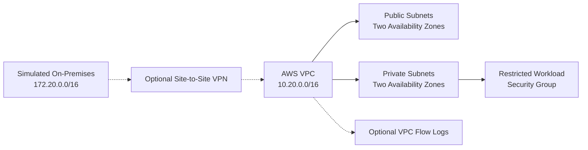

# AWS Hybrid Infrastructure

[](https://github.com/solonsah/aws-hybrid-infrastructure/actions/workflows/terraform-validation.yml)

A modular Terraform framework for secure hybrid connectivity between a simulated on-premises network and a highly available AWS environment.

This portfolio project demonstrates infrastructure design, network segmentation, optional Site-to-Site VPN connectivity, restricted security groups, VPC Flow Logs, cost controls, and automated Terraform validation.

> **Deployment status:** The configuration has been formatted, initialized, and validated locally without AWS credentials. No AWS resources have been deployed.

## Key Features

- Highly available VPC design across two Availability Zones
- Separate public and private subnets
- Independent route tables for network segmentation
- Optional NAT gateways with one-per-zone architecture
- Optional AWS Site-to-Site VPN
- Simulated on-premises network routing
- Restricted workload security group
- Administrative access disabled by default
- Optional VPC Flow Logs with CloudWatch retention
- Least-privilege flow-log delivery role
- Reusable Terraform modules
- GitHub Actions validation without AWS credentials
- Explicit cost and deployment-safety controls

## Architecture



Optional components remain disabled in the default configuration.

See [Architecture Details](docs/architecture.md) and [Architecture Diagrams](diagrams/README.md).

## Repository Structure

```text
.
├── .github/
│   └── workflows/
│       └── terraform-validation.yml
├── diagrams/
│   └── README.md
├── docs/
│   ├── architecture.md
│   ├── deployment-safety.md
│   └── security-controls.md
├── scripts/
│   └── validate.ps1
├── terraform/
│   ├── modules/
│   │   ├── hybrid-connectivity/
│   │   │   ├── main.tf
│   │   │   ├── outputs.tf
│   │   │   └── variables.tf
│   │   ├── monitoring/
│   │   │   ├── main.tf
│   │   │   ├── outputs.tf
│   │   │   └── variables.tf
│   │   ├── networking/
│   │   │   ├── main.tf
│   │   │   ├── outputs.tf
│   │   │   └── variables.tf
│   │   └── security/
│   │       ├── main.tf
│   │       ├── outputs.tf
│   │       └── variables.tf
│   ├── main.tf
│   ├── outputs.tf
│   ├── providers.tf
│   ├── terraform.tfvars.example
│   ├── variables.tf
│   └── versions.tf
├── .gitattributes
├── .gitignore
├── LICENSE
└── README.md
```

Terraform creates `.terraform.lock.hcl` during initialization. The lock file should be committed to preserve the reviewed provider selection.

## Terraform Modules

| Module | Purpose |
|---|---|
| `networking` | Creates the VPC, subnets, Internet Gateway, route tables, and optional NAT gateways. |
| `hybrid-connectivity` | Creates the optional customer gateway, virtual private gateway, VPN connection, and static route. |
| `security` | Creates restricted ingress and egress rules for private workloads. |
| `monitoring` | Creates optional VPC Flow Logs, CloudWatch retention, and a dedicated IAM role. |

## Example Network Plan

| Component | Example CIDR |
|---|---|
| AWS VPC | `10.20.0.0/16` |
| Public subnet A | `10.20.10.0/24` |
| Public subnet B | `10.20.20.0/24` |
| Private subnet A | `10.20.110.0/24` |
| Private subnet B | `10.20.120.0/24` |
| Simulated on-premises network | `172.20.0.0/16` |

All ranges are fictional private examples. Do not publish identifiable workplace network information.

## Security Controls

- Public subnet instances do not receive public IP addresses automatically.
- Administrative SSH ingress is absent by default.
- HTTPS ingress is limited to the VPC and simulated on-premises ranges.
- Workload egress is limited to HTTPS and VPC-scoped DNS.
- VPN resources require deliberate enablement.
- Flow Logs use a dedicated service role.
- Terraform state, plans, credentials, real variable files, and private keys are ignored.
- Provider versions are constrained and recorded in the dependency lock file.
- CI has read-only repository permissions and performs no deployment.

See [Security Controls](docs/security-controls.md).

## Cost-Aware Design

The following features are disabled by default because they may create recurring AWS charges:

```hcl
enable_nat_gateway      = false
enable_site_to_site_vpn = false
enable_vpc_flow_logs    = false
```

When NAT is enabled, the architecture creates one NAT gateway per Availability Zone for resilience. This is appropriate for high availability but costs more than a single shared NAT gateway.

Review current AWS pricing before enabling:

- NAT gateways
- Site-to-Site VPN connections
- Elastic IP addresses
- CloudWatch log ingestion and retention

## Local Validation

### Prerequisites

- Terraform `1.16.x`
- PowerShell
- Internet access for provider installation

AWS credentials are not required for formatting, initialization, or configuration validation.

### Manual Validation

From the repository root:

```powershell
terraform -chdir=terraform fmt -check -recursive
```

```powershell
terraform -chdir=terraform init -backend=false
```

```powershell
terraform -chdir=terraform validate
```

Expected validation result:

```text
Success! The configuration is valid.
```

### Validation Script

```powershell
.\scripts\validate.ps1
```

The script runs formatting checks, backend-free initialization, and validation. It does not run `plan` or `apply`.

## GitHub Actions

The `Terraform Validation` workflow runs when Terraform or workflow files change. It performs:

1. Repository checkout
2. Terraform installation
3. Formatting verification
4. Backend-free initialization
5. Configuration validation

It intentionally does not use AWS credentials and cannot deploy infrastructure.

[View the validation workflow](.github/workflows/terraform-validation.yml)

## Configuration

Copy the example file only when preparing an authorized environment:

```powershell
Copy-Item terraform\terraform.tfvars.example terraform\terraform.tfvars
```

`terraform.tfvars` is ignored because real values may reveal sensitive or environment-specific information.

Before deployment, review:

- AWS region
- Availability Zone names
- VPC and subnet CIDRs
- CIDR overlap
- Administrative source networks
- Customer gateway public address
- BGP ASN
- NAT, VPN, and logging costs

Never commit AWS credentials, VPN secrets, real infrastructure addresses, or Terraform state.

## Deployment Safety

`terraform plan` requires authorized AWS credentials. It was not executed successfully for this portfolio demonstration because no AWS environment was available.

A real deployment requires:

1. An approved AWS account.
2. Short-lived credentials or an approved identity role.
3. Encrypted remote state with locking and recovery.
4. Environment-specific configuration review.
5. Cost and security approval.
6. A reviewed Terraform plan.
7. Post-deployment connectivity and monitoring tests.
8. A rollback or controlled-destruction plan.

See [Deployment Safety](docs/deployment-safety.md).

## Terraform State

Terraform state maps the configuration to real cloud resources. State may contain infrastructure details and generated VPN tunnel information.

Local state files are excluded from Git:

```gitignore
*.tfstate
*.tfstate.*
```

A real shared deployment should use an encrypted, access-controlled remote backend with state locking and version recovery.

## Technologies

- Terraform
- HashiCorp Configuration Language
- AWS VPC
- AWS Site-to-Site VPN
- AWS Identity and Access Management
- Amazon CloudWatch Logs
- GitHub Actions
- PowerShell

## Project Status

- Terraform formatting: Passed
- Terraform initialization: Passed
- Terraform validation: Passed
- AWS deployment: Not performed
- CI validation: Pending first GitHub workflow run
- Real credentials or infrastructure data: Not included

## Limitations

- No AWS resources have been deployed.
- VPN tunnel health and failover have not been runtime tested.
- AWS account quotas and Availability Zone mappings have not been verified.
- Cost estimates require current AWS pricing and a target region.
- Production use requires a secured remote state backend and additional organizational controls.

## License

This project is licensed under the [MIT License](LICENSE).
