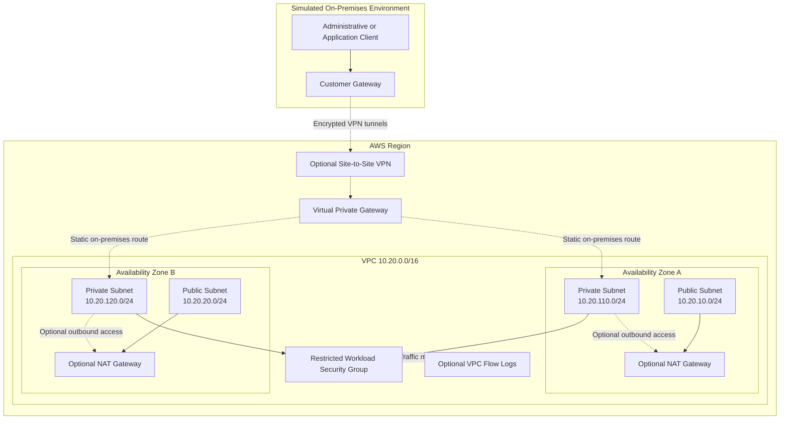
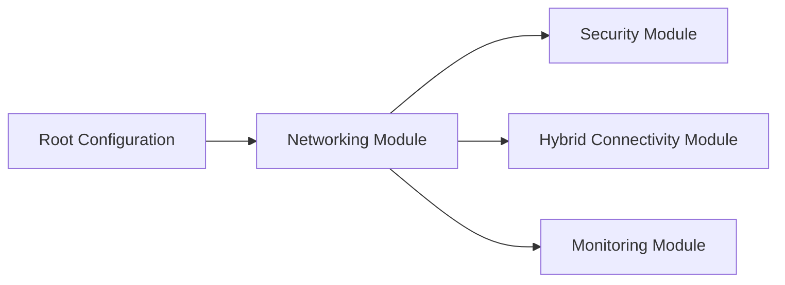

# Architecture Diagrams

## Hybrid Connectivity

Solid lines represent internal resource relationships. Dotted lines represent optional features that remain disabled in the default configuration.

## Terraform Module Flow

The networking module produces the VPC, subnet, and route-table identifiers consumed by the remaining modules.

## Important Boundary

The diagrams represent the intended architecture. They do not prove that resources were deployed. This repository was initialized, formatted, and validated without AWS credentials.
