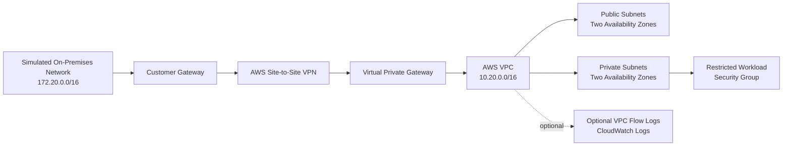

# Architecture

## Overview

This project models secure hybrid connectivity between a simulated on-premises network and a highly available AWS environment. Terraform separates networking, hybrid connectivity, security, and monitoring into reusable modules.

The default configuration is documentation and validation focused. Billable NAT gateways, Site-to-Site VPN connections, and VPC Flow Logs remain disabled until explicitly enabled and reviewed.

## Logical Architecture

## Module Responsibilities

| Module | Responsibility |
|---|---|
| `networking` | Creates the VPC, Internet Gateway, public and private subnets, route tables, and optional NAT gateways. |
| `hybrid-connectivity` | Creates the optional customer gateway, virtual private gateway, Site-to-Site VPN, and on-premises route. |
| `security` | Creates controlled HTTPS, administrative SSH, DNS, and outbound HTTPS security-group rules. |
| `monitoring` | Creates optional VPC Flow Logs, CloudWatch log retention, and a least-privilege delivery role. |

## Availability Design

The default example uses two Availability Zones:

- `us-east-1a`
- `us-east-1b`

Each Availability Zone receives one public subnet and one private subnet. If NAT is enabled, the module creates one NAT gateway per Availability Zone to avoid a single-zone dependency.

Availability Zone names can vary between AWS accounts. Review and replace the example values before deployment.

## Network Segmentation

| Network | Example CIDR | Purpose |
|---|---|---|
| AWS VPC | `10.20.0.0/16` | Overall AWS address space |
| Public subnet A | `10.20.10.0/24` | Public-tier resources in the first Availability Zone |
| Public subnet B | `10.20.20.0/24` | Public-tier resources in the second Availability Zone |
| Private subnet A | `10.20.110.0/24` | Private workloads in the first Availability Zone |
| Private subnet B | `10.20.120.0/24` | Private workloads in the second Availability Zone |
| Simulated on-premises | `172.20.0.0/16` | Documentation-only enterprise network example |

These private address ranges are fictional and must not be replaced with identifiable workplace networks in the public repository.

## Security Controls

- Public IP assignment is disabled on public subnets by default.
- Administrative SSH rules are absent unless approved source CIDRs are explicitly supplied.
- HTTPS ingress is restricted to the VPC and simulated on-premises networks.
- Workload egress is limited to HTTPS and VPC-scoped DNS.
- VPN and monitoring resources are disabled by default.
- Terraform state, credentials, private keys, environment files, and real variable files are excluded from Git.
- Provider versions are constrained and recorded in `.terraform.lock.hcl`.

## Monitoring

Optional VPC Flow Logs can capture accepted and rejected traffic metadata and publish it to CloudWatch Logs. The module includes:

- All-traffic capture
- Sixty-second aggregation
- Configurable retention
- A dedicated IAM delivery role
- Restricted log-delivery permissions

Enabling flow logs may create CloudWatch ingestion and storage charges.

## Cost Controls

The following features remain disabled by default because they can produce recurring charges:

- NAT gateways
- AWS Site-to-Site VPN
- VPC Flow Logs and CloudWatch log storage

Always review `terraform plan` and current AWS pricing before deployment.

## Deployment Boundary

This repository demonstrates validated Infrastructure as Code. It does not automatically deploy infrastructure. Any deployment requires:

1. An approved AWS account and credentials.
2. Reviewed environment-specific variables.
3. A secured remote state backend for shared or production use.
4. Cost and security review.
5. `terraform plan` inspection and approval.
6. A documented rollback or destruction plan.
